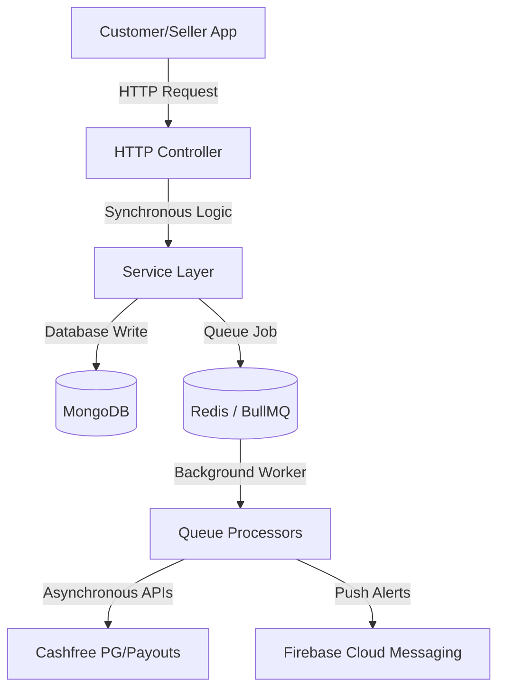

# Trystop Backend Documentation
## Payments, Wallet, Offers, Reviews, Rankings & Ads
### Comprehensive Architecture & Client Integration Guide

This backend implementation introduces modular services to handle local wallet balances, verified purchase reviews, Rolling 30-day seller visibility rankings, proximity-based ad serving, and nightly batch settlements. All business logic is isolated, tested, and wrapped with strict DTO validation rules.

---

## 1. System Architecture & Core Libraries
The module is built on NestJS using the following core packages:
*   **`axios`**: Used for executing secure, typed HTTPS requests to Cashfree PG and Payouts sandboxes. Base URLs are environment-controlled to enable instant swapping between Sandbox and Production via environment configuration alone.
*   **`firebase-admin`**: Powering client push alerts (with custom louder notification channels/sounds) for verified transaction confirmations.
*   **`bullmq` & `@nestjs/bull`**: Decouples side-effects (wallet calculations, push alerts, coupon counts) from the main HTTP response threads to guarantee high concurrency and ultra-low response latency.
*   **`@nestjs/schedule`**: Used to bootstrap repeatable scheduling jobs mapped directly inside Redis.
*   **`mongoose` & `@nestjs/mongoose`**: Handles all MongoDB ledger writes, platform settings, reviews, and coupon usage records.



---

## 2. Seller Onboarding & Payout Vendor Registration
Before a merchant can receive daily bulk payouts, they must be registered as a Cashfree Vendor. This process maps KYC details and initiates automated bank details verification.

### Vendor Onboarding Endpoint
`POST /sellers/:id/cashfree-vendor`
*   **Access Control**: Superadmin or Subadmin with `manage_sellers` permission.
*   **Request Body**:
    ```json
    {
      "businessType": "individual" // Optional override: individual, sole_proprietorship, partnership, llc
    }
    ```
*   **Operations & Logic Flow**:
    1. Retrieves the seller's profile, including their registered PAN, bank account number, IFSC code, and legal account holder name from the DB.
    2. Submits a registration request to Cashfree's **Vendor Management API**.
    3. Includes the option `verify_account: true`. Cashfree automatically initiates a **Penny-Drop transaction** (crediting ₹1 to the account) to verify bank details directly with the node bank.
    4. Saves the returned `cashfreeVendorId` and sets `cashfreeVendorStatus` to `pending`. Once penny-drop success is validated, the vendor is cleared for nightly payout settlements.

---

## 3. Shop & Product Browsing APIs (Customer Flow)
To enable customers to explore shops, view category structures, and filter products locally, the backend exposes three public endpoints:

### A. List All Shops (Sorted by Ranking Score)
`GET /sellers/ranked?page=1&limit=20`
*   **Access**: Public (no authentication required).
*   **Logic**: Retrieves all verified and approved sellers sorted by their cached `rankingScore` (descending).
*   **Response Fields**: Returns public shop descriptors: `shopName`, `shopLogoUrl`, `shopAddress`, `categories` array (available categories), `avgRating`, and `reviewCount`.

### B. Retrieve Shop Profile & Listed Categories
`GET /sellers/:id`
*   **Access**: Public.
*   **Logic**: Fetches details for a specific seller by ID. Returns the list of categories this shop sells in (e.g., `["men", "women", "kids"]`).
*   **Security**: Excludes all sensitive fields like bank details, PAN/GST numbers, fcmTokens, or passwords.

### C. Retrieve Products in a Shop Category
`GET /products?sellerId=<seller_id>&category=<category_id_or_slug>`
*   **Access**: Public.
*   **Logic**: Filters products uploaded by the specific seller matching the selected category. The filters are combined via MongoDB **additive AND logic** to ensure accurate PDP results.

---

## 4. In-Store QR Payments & Checkout Flow

> [!IMPORTANT]
> **Core Architecture Decision**
> Trystop collects all customer payments into a central master account during the day. Settlements to merchants are processed in a single nightly batch at midnight. Per-order real-time splits are avoided because high wallet redemption rates would cause live splits to fail if the online payment portion is lower than the merchant's net share.

### A. Create Payment Order
`POST /payments/create-order`
*   **Access Control**: Authenticated Customer (`user` role only). Rate-limited to 10 requests/minute.
*   **Request Schema**:
    ```json
    {
      "sellerId": "64f89d3e8b091f001c...", // The ID of the merchant shop being paid
      "totalAmount": 500.00,                 // The gross bill amount
      "useWalletAmount": 125.00,             // Optional: amount to pay using wallet balance
      "couponCode": "WELCOME50"              // Optional: coupon discount code
    }
    ```
*   **Calculations & Rules Engine**:
    1. **Coupon Validation**: Validates coupon code limits. If a coupon is matched, it computes the discount and reduces the bill:
       `effectiveTotal = totalAmount - couponDiscount`.
    2. **Dynamic Wallet Cap Resolution**:
        *   Checks the user's profile for a specific `walletUsageCap` override.
        *   If no override is present, it falls back to the global platform config: `wallet_usage_cap` (default is 75%).
        *   Calculates the maximum allowed wallet usage: `maxWalletAllowed = effectiveTotal * walletCap`.
        *   If the requested `useWalletAmount` exceeds this limit, it is automatically capped to `maxWalletAllowed`.
    3. **Breakdown Calculations**: Evaluates the commission rate, PG fee shares, customer cashback, and net payout (see Section 6 for full breakdown formulas).
    4. **Local Ledger Transaction**: Saves a local `Transaction` record in the DB marked as `pending`. This snapshots all applied rates and fees for future audits.
    5. **Cashfree Order Initialization**: Creates an order via the Cashfree PG API for the online portion only:
       `amountToChargeOnline = effectiveTotal - useWalletAmount`. Returns the payment link and dynamic QR parameters.

### B. Idempotent Webhook Handler
`POST /payments/webhook`
*   **Access Control**: Public (called securely by Cashfree).
*   **Verification & Safety Rules**:
    1. **Signature Verification**: Computes the SHA256 HMAC of the raw request payload using `CASHFREE_WEBHOOK_SECRET` and compares it to the incoming `x-webhook-signature` header.
    2. **Idempotency Lock**: Looks up the transaction by `cashfreeOrderId`. If the local status is already marked `paid`, the webhook is acknowledged immediately, and execution terminates. This prevents double-crediting if Cashfree sends duplicate webhook notifications.
    3. **Async Event Dispatching**: Updates the transaction status to `paid` and queues the post-payment side-effects as independent jobs in BullMQ (FCM push notifications, cashback credits, ranking updates, coupon counts). If any background task fails, BullMQ retries it individually without affecting the payment webhook response.

---

## 5. Wallet Ledger & Cashback Rules
The local wallet system enforces transactional audit trails. A user's wallet balance is never stored as a single, mutable floating number without ledger tracing.

### Wallet Ledger
*   The `WalletTransaction` collection records all entries.
*   Every credit (cashback, admin promo) and debit (redemption, order checkout) is executed inside a **Mongoose Database Transaction session**. This writes the ledger entry and increments/decrements the user's `walletBalance` atomically.

### Admin Wallet Audit Metrics
*   **Endpoint**: `GET /wallet/admin/metrics`
*   **Access Control**: Admin Only (`superadmin` or `subadmin` with `manage_wallet` permission).
*   **Purpose**: Aggregates total outstanding system liability. Returns the sum of all users' cached `walletBalance` (total coins currently circulating in the system), the total credits given, and total debits redeemed. This helps the platform manage and maintain matching liquid assets/reserve balances in their bank account.

### Cashback Calculation Rule (§3.2)
To prevent infinite cashback loops, cashback is **strictly calculated only on the online payment portion**, not on the portion covered by the wallet:
```
cashbackEarned = effectiveCashbackRate * amountPaidOnline
```

**Mathematical Example**:
For a bill of ₹500, if a customer pays ₹375 using their wallet and ₹125 online via UPI:
*   **Amount Paid Online**: ₹125
*   **Cashback Rate**: 10%
*   **Cashback Earned**: `₹125 * 0.10 = ₹12.50` (instead of 10% of ₹500 = ₹50).

---

## 6. Commission Splits & Nightly Settlements
Cashfree charges a 2% gateway collection fee on all online payments. This fee is split equally (50/50) between Trystop and the merchant (1% each).

### Split Formulas
*   `commissionAmount = grossBillAmount * commissionRate` (commission rate is resolved per-seller, fallback to global config 15%)
*   `pgFeeTotal = grossBillAmount * 0.02`
*   `pgFeeTrystopShare = pgFeeTotal * 0.50` (1%)
*   `pgFeeSellerShare = pgFeeTotal * 0.50` (1%)
*   `sellerNetPayout = grossBillAmount - commissionAmount - pgFeeSellerShare`
*   `trystopRetainedShare = commissionAmount - pgFeeTrystopShare`

**Merchant Payout Rule**: The seller's payout is always calculated based on the **Gross Bill Amount**, meaning their earnings are unaffected by whether the customer pays using a wallet or cash. Trystop absorbs the wallet redemption costs from its central pool.

| Scenario Parameters | Scenario A: No Wallet Used | Scenario B: Max Wallet Used (75%) |
| :--- | :--- | :--- |
| **Gross Bill Amount** | ₹500.00 | ₹500.00 |
| **Wallet Used** | ₹0.00 | ₹375.00 |
| **Online Collection (UPI)** | ₹500.00 | ₹125.00 |
| **Commission (15%)** | ₹75.00 | ₹75.00 |
| **Total PG Fee (2%)** | ₹10.00 (Trystop: ₹5 \| Seller: ₹5) | ₹10.00 (Trystop: ₹5 \| Seller: ₹5) |
| **Seller Payout (Gross - Comm - SellerPG)** | **₹420.00** | **₹420.00** |
| **Trystop Net Retained Share** | ₹70.00 | -₹295.00 (drawn from float pool) |

### Nightly Payout & Settlement Cron
A background job runs automatically at **00:00 midnight** daily:
1. Queries all successful payments marked as `paid` and `unsettled`.
2. Groups transactions by `sellerId` and calculates the cumulative daily net payout for each seller.
3. Executes bulk payouts using the **Cashfree Payouts API** to transfer funds directly to each seller's bank account.
4. To handle partial network failures, the job updates transaction status to `processing` during the run. Failed transfers revert to `unsettled`, allowing the cron to be re-run safely without double-settling successfully processed vendors.
5. Runs an automated **Reconciliation Script** comparing Cashfree's settlement reports with the local database ledger, logging any discrepancy for manual review.

---

## 7. Shop Ranking Engine
To incentivize merchants to process payments through the Trystop application, visibility rankings are heavily tied to verified online transaction volumes.

### Scoring Formula
```
rankingScore = (normalizedAvgRating * 0.35) + (normalizedReviewCount * 0.15) + (normalizedOnlineTxnVolume * 0.50)
```
*   **normalizedAvgRating**: Seller's average rating (1–5) scaled to 0–1 (`avgRating / 5`).
*   **normalizedReviewCount**: Log-scaled review count relative to the top seller. Diminishing returns prevent top-tier shops from dominating infinitely:
    `log(1 + reviewCount) / log(1 + maxReviewCountAcrossAllSellers)`.
*   **normalizedOnlineTxnVolume**: Log-scaled count of successful payments processed over a **rolling recent 30-day window**. 
    Because it tracks a rolling 30-day window instead of lifetime volume, a merchant who moves customer payments to cash will see their ranking score drop quickly.

---

## 8. Proximity-First Ad Serving Engine
Sellers can purchase visibility boosts for their shop or products at a flat daily rate (configured by admins, default is ₹50/day for shops, ₹25/day for products).

### Ad Serving Endpoint
`GET /ads/active?lat=26.85&lng=75.82&slot=home_banner`
*   **Query Parameters**: Requesting user's latitude and longitude, slot type (`home_banner`, `product_placement`, `shop_listing`), and result limit.
*   **Proximity Sorting**: Filters to active, paid ads for the selected slot, and calculates the distance to the user using the **Haversine Formula**:
    ```
    d = 2 * R * asin(sqrt(sin²(Δlat/2) + cos(lat1) * cos(lat2) * sin²(Δlng/2)))
    ```
    Ads are sorted with the nearest store first.
*   **Round-Robin Tie-Breaking**: If multiple ads fall within the same distance threshold, they are sorted by `lastServedAt` (oldest/never served first). The database updates `lastServedAt = now` upon serving, guaranteeing fair exposure for competing merchants.

---

## 9. Client API Integration Checklist

### A. Customer Shop Browsing Flow
1. Fetch the list of ranked shops: `GET /sellers/ranked`.
2. When the user clicks a shop, fetch the shop profile and display the categories they list: `GET /sellers/:id`.
3. When a user selects a category within the shop, fetch the products matching both filters: `GET /products?sellerId=<id>&category=<category>`.

### B. Scan-to-Pay Payment Flow
1. Parse the `sellerId` from the scanned store QR code.
2. Query the user's wallet balance: `GET /wallet/balance`.
3. (Optional) If a promo code is entered, validate it: `GET /offers/coupons/:code/validate?orderAmount=<amount>`.
4. Submit order details: `POST /payments/create-order`.
5. Initialize the Cashfree Payment SDK using the returned payment session parameters.
6. Upon payment success, confirm the transaction status by checking the user's transaction history: `GET /payments/my-transactions`. *Do not trust the client-side redirection state directly.*

### C. Post-Purchase Review
1. Only users who have completed a transaction with a seller can leave a review.
2. Submit reviews via `POST /reviews` with the `transactionId`, `sellerId`, `rating` (1–5), and a comment.
